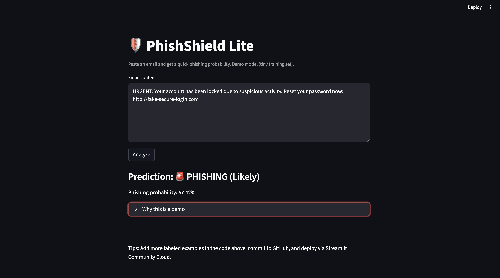

# 🛡️ PhishShield Lite  
An AI-powered phishing email detector built with Python and scikit-learn.  
This lightweight demo lets you paste email text and instantly see whether it’s likely **phishing** or **legit**.  

---

## 🚀 Features
- Classifies emails using a simple ML pipeline (TF-IDF + Logistic Regression).  
- Provides phishing probability (%) for transparency.  
- Runs as a **Streamlit web app** — no setup beyond installing requirements.  
- Demo dataset included — can be expanded with more labeled emails.  

---

## ⚡ Quick Start

Clone the repo and install dependencies:

```bash
git clone https://github.com/yourusername/PhishShield.git
cd PhishShield
python -m pip install --upgrade pip
pip install -r requirements.txt

Run the app with Streamlit:

streamlit run app.py


Then open the URL (default: http://localhost:8501
) in your browser.





## 🛠️ Skills & Tech Used
- **Python** for backend development  
- **scikit-learn** for ML text classification  
- **Streamlit** for interactive web app  
- **Pandas** for data handling  
- **Cybersecurity focus**: phishing detection use case


## 🔮 Future Improvements
- Expand training dataset for higher accuracy  
- Add email header analysis (sender, domain reputation)  
- Deploy live with Streamlit Cloud or Heroku for public demo  


